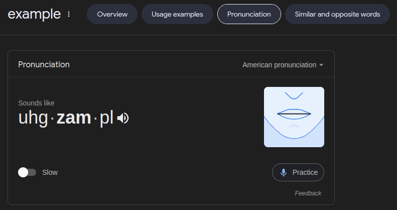

# Google Pronunciation (gstatic)

If you search for words' pronunciations frequently, you know that searching `<word> pronunciation` or `how to pronounce <word>` on Google shows a pronunciation widget:



This script allows you to fetch and play pronunciations directly, bypassing the need to search Google.

## Features
- **Fetch Pronunciations**: Automatically downloads pronunciation audio files for the specified word.
- **Automatic Playback**: Opens the downloaded audio file in the default media player.
- **Cross-Platform**: Works on Windows, macOS (not tested), and Linux.

## Requirements
- Python 3.x
- `requests` library

Install the required library using pip:
```sh
pip install requests
```

## Usage
1. Clone the repository
    ```sh
   git clone https://github.com/amir-mahdih86/google-pronunciation.git
   ```
2. Navigate to the project directory:
   ```sh
   cd google-pronunciation
   ```
3. Run the script:
   ```sh
   python main.py
   # maybe you need to use `python3` or `py` instead of `python`
   ```
4. Follow the prompts:
   - Enter the word you want to search for.
   - The script will download the pronunciation if it exists and play it.

## Example
Here's a sample interaction with the script:
```sh
python main.py
# Please enter a word: example
# Downloading from url 1 ..... Ok
# Would you like to check for another word? (Y/n)
```
## Future Enhancements
- [ ] Create a graphical user interface (GUI)
- [ ] Integrate a built-in sound player

## Contributing
Contributions are welcome! Feel free to open issues or submit pull requests.

## Acknowledgements
- The script uses pronunciation files from Google's gstatic servers.
- Inspired by frequent Google searches for pronunciations.
